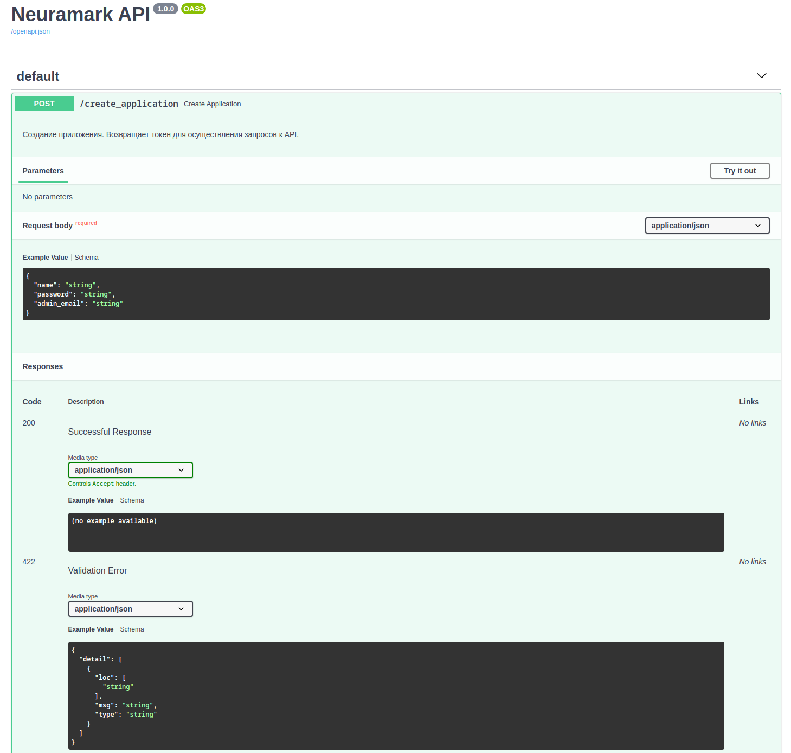

# frontend

Внешнее API для взаимодействия с сервисом `Neuramark`. Используемые технологии:
* `python 3.8`
* `fastapi` + `uvicorn`
* `JWT`
* `docker-compose` - для запуска сервиса.

Отвечает за авторизацию и аутентификацию. Для работы с сервисом `Neuramark` необходимо создать приложение, после чего вам будет возвращен персональный токен.
Данным токеном подписываются все запросы к API.

## Настройка и запуск сервера

1. [Настройка API](#настройка-API)
1. [Запуск API](#запуск-API)
    * [Генерация ключей для JWT](#генерация-ключей-для-jwt)
1. [Использование API:](#использование-API)

### Настройка API

Перед запуском API внесите следующие изменения в файл [docker-compose.yml](docker-compose.yml):

* `USE_SOCK_FILE` - Использовать ли socket файл? Допустимые значения: True, False;
* `BACKEND_API_URL` - URL адресс для подключения к Backend Service;
* `METADATA_API_URL` - URL адресс для подключения к Metadata Service.

### Запуск API

Для запуска сервиса в режиме отладки выполните следующую команду в папке с проектом: `docker-compose -f compose-dev.yml up`.

Для запуска сервиса в продакшене выполните следующую команду в папке с проектом: `docker-compose up -d`.

#### Генерация ключей для JWT

```bash
ssh-keygen -t rsa -b 1024 -m PEM -f jwt.key
# Don't add passphrase
openssl rsa -in jwt.key -pubout -outform PEM -out jwt.key.pub
```

### Использование API

При запуске в режиме отладки документация сервиса будет доступна по адресу: `127.0.0.1:8080/docs`.

На данном адресе расположен `Swagger UI`, который дает возможность опробовать `API` напрямую из web-интерфейса.


